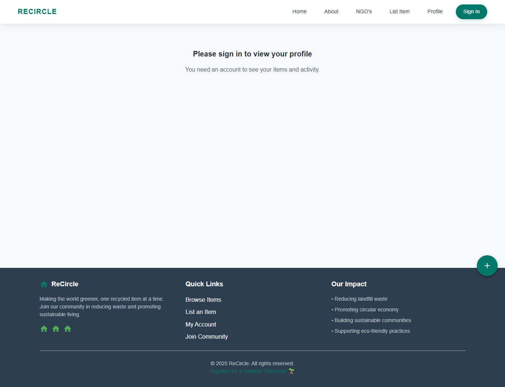

# ReCircle – A Web Platform for Recycling and Reuse

ReCircle is a web application that helps people list and discover reusable items, promoting a circular economy and reducing waste. The project features a responsive UI built with React and Material UI, secure authentication, and an organized items catalogue with search and filtering.

## Project Overview (Screenshots)

These screenshots are generated from the production build and provide a quick visual overview of the design and key screens.

> If images do not load in GitHub, browse to the `frontend/screenshots/` folder directly.

- Home

  

- About

  

- Login

  

- Register

  

- NGOs

  

- Create Item (protected)

  

- Profile (protected)

  

## Design Highlights

- Modern UI with Material UI components and theming
- Responsive layout for desktop and mobile
- Clean routing with React Router (SPA)
- Centralized item catalogue with search and filtering
- Authentication with protected routes for creating/editing items

## Tech Stack

- Frontend: React, React Router, Material UI
- Backend: Node.js, Express
- Database: MongoDB (via Mongoose)

## Local Development

- Backend
  - `cd backend`
  - `npm install`
  - `npm run dev`

- Frontend
  - `cd frontend`
  - `npm install`
  - `npm start`

## Production Build

- Frontend: `cd frontend && npm run build`
- Screenshots: `node frontend/scripts/screenshot.js` (saves PNGs into `frontend/screenshots/`)

---

For deployment guidance and environment variables, see `DEPLOY.md`.
