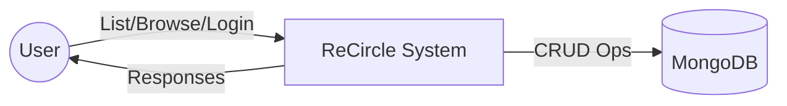
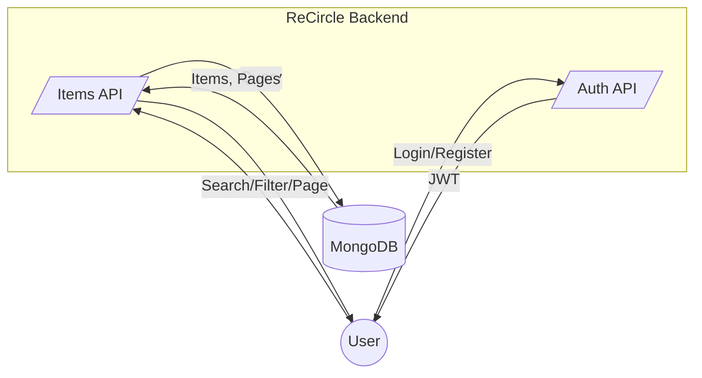
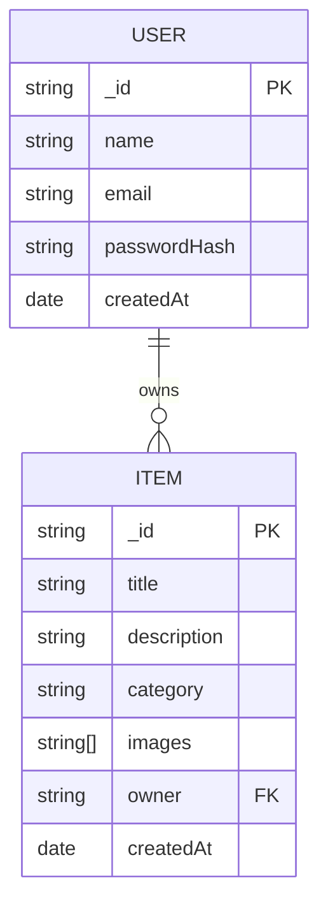
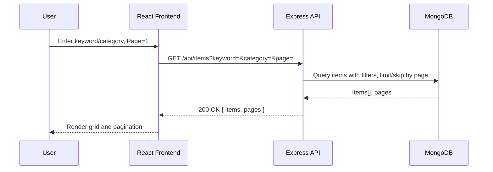

## Cover Page

**Title**: ReCircle – A Web Platform for Recycling and Reuse

**Project Type**: Full-Stack Web Application (MERN)

**Authors**: [Your Name(s)]  
**Guide/Supervisor**: [Guide Name]  
**Institute**: [Institute/Department]  
**Academic Year**: 2025  
**Submission Date**: [Date]

---

## Certificate of Authenticity

This is to certify that the project titled “ReCircle – A Web Platform for Recycling and Reuse” is an original work carried out by [Your Name(s)], under the guidance of [Guide Name], in partial fulfillment of the requirements for [Program/Degree] at [Institute]. The project has not been submitted elsewhere for any other award.

Guide Signature: __________  
Head of Department: __________  
Date: __________

---

## Declaration

I/We hereby declare that the work presented in this project report entitled “ReCircle – A Web Platform for Recycling and Reuse” is our original work and has not been plagiarized. All sources of information have been duly acknowledged.

Student(s) Signature(s): __________  
Date: __________

---

## Acknowledgement

We express our gratitude to [Guide Name] for guidance and support. We thank our institute and department for resources and infrastructure. We also acknowledge the open-source community behind React, Material UI, Express, and MongoDB.

---

## Abstract

ReCircle is a MERN-based platform that promotes circular economy by enabling users to list unused items, browse available items, and connect with others for reuse or donation. The front end (React + Material UI) provides modern UI/UX, search, filtering, and profile features. The backend (Node.js + Express + MongoDB) exposes secure REST APIs for authentication, items, and user management. The system supports JWT-based authentication, category filtering, pagination, and a deployment-ready configuration for Vercel/Render.

---

## Chapter 1: Introduction

- **Problem Statement**: Unused items often end up as waste due to lack of easy reuse channels.
- **Objectives**:
  - Provide a listing platform for items.
  - Enable discovery via search/filter and pagination.
  - Provide authentication and profiles.
  - Ensure a responsive UI with modern UX.
- **Scope**: Register/login, list/browse items, item details, profile area, search/filter, pagination, deployment on cloud.
- **Technologies**: React, Material UI, React Router, Axios; Node.js, Express, MongoDB, Mongoose; JWT; CORS.

---

## Chapter 2: Literature Survey

- **Existing Platforms**: General classifieds (OLX, Craigslist) and donation apps.
- **Gap**: Lack of sustainability‑first UX and specialized workflows.
- **Justification**: ReCircle focuses on reuse/recycling with a clean React UI and dedicated item workflows.

---

## Chapter 3: System Requirements Specification

- **Functional Requirements**:
  - User registration and login (JWT).
  - List items with title, description, category, images.
  - Browse items with keyword search, category filter, pagination.
  - View item details.
  - Profile with “My Items”.
  - Protected routes for create/edit.
- **Non-Functional Requirements**:
  - Usability: Responsive UI with Material UI.
  - Reliability: Health check; stable DB connection.
  - Security: JWT auth; CORS whitelist.
  - Performance: Pagination; efficient queries.
  - Deployability: Env-driven config; .env handled safely.
- **Constraints/Assumptions**:
  - Requires `MONGO_URI` and `JWT_SECRET`.
  - Optional Cloudinary/Firebase for future features.

---

## Chapter 4: System Design

### 4.1 High-Level Architecture

```mermaid
flowchart LR
  User((User)) -- HTTP/HTTPS --> Frontend[React SPA (Vercel/Static Host)]
  Frontend -- Axios REST --> API[Express Server (Render/Node >=18)]
  API -- Mongoose --> DB[(MongoDB)]
  subgraph Frontend App
    R1[React Router]
    C1[Material UI Theme]
    C2[AuthContext]
  end
  Frontend --> R1
  Frontend --> C1
  Frontend --> C2
```

### 4.2 Data Flow Diagrams (DFD)

DFD Level 0 (Context Diagram):



DFD Level 1 (Item Listing/Browsing):



### 4.3 Entity-Relationship Diagram (ER)



### 4.4 Sequence Diagram (Search & Pagination)



---

## Chapter 5: Implementation

- **Frontend**
  - Routing in `frontend/src/App.js` with protected routes.
  - Screens: Home, Item, Create, Edit, Login, Register, NGOs, About, Profile.
  - Components: Header, Footer, ItemCard, FloatingUploadButton, ProtectedRoute.
  - State/Context: `AuthContext` for auth and tokens.
  - API base: `REACT_APP_API_URL` or localhost fallback.
- **Backend**
  - Entry: `backend/server.js` with CORS whitelist, health check, route mounts.
  - Models: `backend/models/User.js`, `backend/models/Item.js`.
  - Controllers: `backend/controllers/userController.js`, `backend/controllers/itemController.js`.
  - Routes: `backend/routes/authRoutes.js`, `itemRoutes.js`, `userRoutes.js`, `ngoRoutes.js`.
  - Middleware: `backend/middleware/authMiddleware.js`, `errorMiddleware.js`.

---

## Chapter 6: Testing

- React Testing Library setup: `frontend/src/setupTests.js`, `App.test.js`.
- Manual checks: auth, item create/list, search/filter/pagination, profile my-items.
- Health: `GET /health` shows service and DB status.

---

## Chapter 7: Conclusion and Future Scope

- **Conclusion**: ReCircle delivers a clean, deployable foundation for reuse/recycling.
- **Future Scope**: Cloudinary image upload, admin roles, notifications, chat/pickup flows, analytics.

---

## Bibliography

- React – `https://react.dev/`
- Material UI – `https://mui.com/`
- Express – `https://expressjs.com/`
- Mongoose – `https://mongoosejs.com/`
- JWT – `https://jwt.io/`
- Axios – `https://axios-http.com/`
- React Router – `https://reactrouter.com/`

---

## Appendix A: Source Code

- Repository Structure
  - `frontend/` – React app (components, screens, context, theme)
  - `backend/` – Express API (routes, controllers, models, middleware)
  - Root: `render.yaml`, `DEPLOY.md`, `SECRETS_ROTATION_CHECKLIST.md`

---

## Appendix B: Screenshots

Add screenshots to `screenshots/` and reference here:

- Home (hero + items grid)
- Login/Register
- Create Item
- Item details
- Profile
- Health endpoint response


